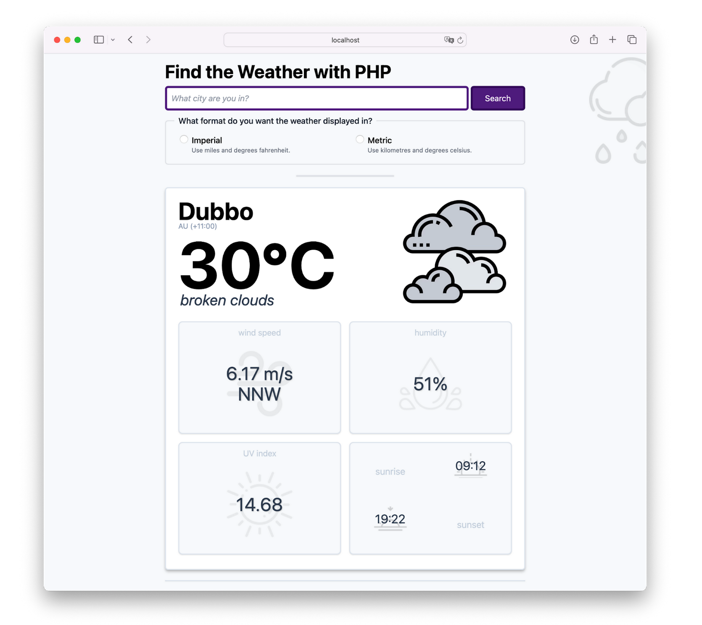

# PHP Weather App

This is a small PHP web-based application that retrieves and renders the weather for a given city or town around the world. 

Using the [OpenWeatherMap API](https://openweathermap.org/api), the [Slim Framework](https://www.slimframework.com), [Guzzle](https://docs.guzzlephp.org/en/stable/), and a collection of other packages, it provides a stylish and professional application to display the weather in both metric and imperial formats for wherever you live in the world.

It's not the most sophisticated, but it works.

## Getting Started

To get started with the application, make sure your have the following:

- PHP 8.3 with the [SimpleXML](https://www.php.net/manual/de/book.simplexml.php), [PCRE](https://www.php.net/manual/de/book.pcre.php), [LibXML](https://www.php.net/manual/de/book.libxml.php), and [JSON](https://www.php.net/manual/de/book.json.php) extensions. Ensure that your PHP runtime does not [auto-start](https://www.php.net/manual/en/session.configuration.php#ini.session.auto-start) sessions.
- [Composer](https://getcomposer.org) installed globally
- A free or paid OpenWeatherMap account
- Your preferred IDE or text editor
- Your preferred browser
- Some prior experience with the Slim Framework and [Twig templates](https://twig.symfony.com) would be ideal, but not necessary

**Note:** to update the style sheet, you'll need [npm][npm-url].

Then, clone the code locally, and start it using your preferred web server.
For the purposes of a simple example, the following commands clone the code, change into the cloned project directory, and start the application using [PHP's built-in web server](https://www.php.net/manual/en/features.commandline.webserver.php).

```bash
git clone git@github.com:settermjd/php-weather-app.git
cd php-weather-app
php -S 0.0.0.0:8080 -t public
```

After that, open http://localhost:8080 in your browser of choice.



## Making changes

### Making frontend changes

To update the stylesheet, first install the frontend dependencies by running the command below.

```bash
npm install
```

Then, run [npx](https://www.npmjs.com/package/npx) to update the stylesheet whenever a change is made in one of the Twig templates, by running the command below.

```bash
npx tailwindcss \
    -i ./src/styles.css \
    -o ./public/css/styles.css \
    --watch
```

Now, make the changes that you want/need.

## Support

If you find a problem with the code, please [create an issue][new-issue-url] in the project's repository.

[new-issue-url]: https://github.com/settermjd/php-weather-app/issues/new/choose
[npm-url]: https://www.npmjs.com/
